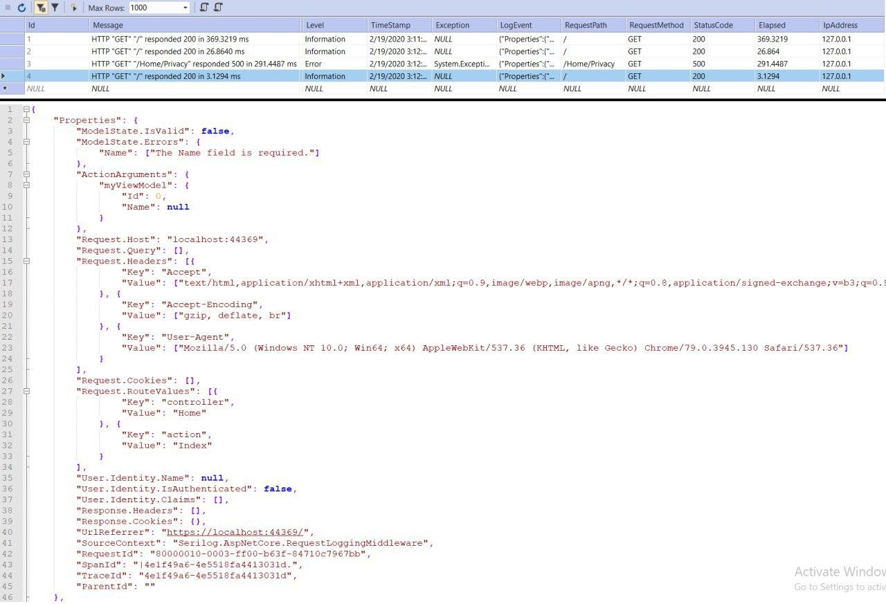

# RequestLogger

    Log Request and Response Details of your Actions in ASP.NET Core.

## Log Details

- Execution date time (TimeStamp)
- Execution duration (Elapsed)
- Action Arguments (like your ViewModels)
- ModelState (IsValid and Errors)
- Request Path (Host and QueryString and RouteValues)
- Request Method
- Request Cookies
- Request Headers
- User.Identity (UserName and IsAuthenticated and Claims)
- Response Cookies
- Response Headers
- Response StatusCode
- IpAddress
- UrlReferrer
- Exception if thrown

> You can add your desired details like UserAgent info (such as browser, os, ... details) in `LogRequestAttribute.OnActionExecuting`

## Usage

Just put `[LogRequest]` attribute on your actions or register it globally

```csharp
public class HomeController : Controller
    {
        public HomeController()
        {
        }

        [LogRequest]
        public IActionResult Index(MyViewModel myViewModel)
        {
            return View();
        }

        [LogRequest]
        public IActionResult Privacy()
        {
            throw new Exception("test");
            return View();
        }
    }
```

Check out [`Program.cs`](https://github.com/dotnetzoom/RequestLogger-AspNetCore/blob/master/RequestLogger/Program.cs) and [`Startup.cs`](https://github.com/dotnetzoom/RequestLogger-AspNetCore/blob/master/RequestLogger/Startup.cs) to see how to Configuration.

This uses [Serilog](https://github.com/serilog/serilog) and [Serilog.AspNetCore](https://github.com/serilog/serilog-aspnetcore) for logging and [MSSqlServer](https://github.com/serilog/serilog-sinks-mssqlserver) sink but you can use any other [Sinks](https://github.com/serilog/serilog/wiki/Provided-Sinks).

## ScreenShot


